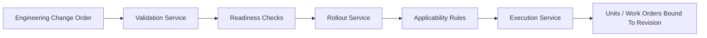

# Design Engineering Change Rollout Into A Live Factory

## Example Prompt

An engineering change updates a BOM, work instruction, routing step, or test procedure. Design how the change is safely rolled out into a live production environment without stopping the plant unnecessarily.

## Why Anduril Would Ask This

This prompt sits right at the intersection of:

- software
- manufacturing
- change management
- operational risk

Anduril clearly cares about moving fast while keeping production real.

That means a good candidate needs to understand:

- factories do not flip atomically
- product definition and execution interact in complicated ways
- rollout safety is part of the design, not an afterthought

## Manufacturing Context

An engineering change can affect:

- which parts are valid
- which instructions operators must follow
- which test limits apply
- which stations need software or tooling updates

That means a "simple revision update" can break live production if the rollout model is naive.

## Core Insight

This is basically deployment orchestration for the physical world.

The hard part is not storing the new revision.

The hard part is deciding:

- when it becomes effective
- which work orders and units it applies to
- which stations are ready
- how mixed old/new revisions coexist during transition

## Objects To Model

- `EngineeringChangeOrder`
- `BOMRevision`
- `RoutingRevision`
- `InstructionRevision`
- `TestRevision`
- `ApplicabilityRule`
- `StationCapabilityVersion`
- `WorkOrderRevisionBinding`

## Architecture

### Change Definition Service

Owns:

- proposed changes
- approvals
- dependency checks
- effective-date rules

### Compatibility Validation

Checks:

- station software compatibility
- required tooling availability
- inventory readiness
- training completion if relevant
- dependency on other system changes

### Rollout Service

Responsible for:

- activating revisions
- applying rules by site, line, work order, or serial range
- tracking rollout status
- rollback or pause decisions

## Applicability Rules

This is the heart of the design.

A revision should not just be "latest."

It should apply by rules like:

- new work orders only
- serial numbers above threshold
- specific factory only
- specific product variant only
- after prerequisite station update is complete

That is what allows mixed-revision operation safely.

## Flow

1. Engineering publishes proposed change.
2. Validation runs compatibility and readiness checks.
3. Rollout service creates a staged plan.
4. Work orders and stations become eligible based on applicability rules.
5. Execution service reads the correct active revision for each unit at runtime.
6. All units record which revision they were actually built under.

## How I Would Drive This Conversation

I would start by clarifying:

- what kind of changes we are rolling out
- whether the change affects in-flight work
- whether rollout can be staged by site, line, or cohort
- what rollback means in this environment

Then I would frame it as a control-plane problem:

- version definitions
- validate readiness
- apply rollout rules
- bind execution to explicit versions

## Important Tradeoffs

### Hard Cutover Versus Mixed Revision

I would explicitly choose:

- mixed revision support

Why:

- physical operations almost never support clean atomic cutover
- units already in progress cannot always restart safely

### Mutable Latest Revision Versus Revision Binding

I would bind:

- work orders or units to explicit revisions once execution begins

Why:

- historical truth matters
- in-flight work must remain explainable

### Rollback

Rollback is not always symmetric.

If a physical step has already happened, you may not be able to "undo" it just because software reverted.

So rollback needs:

- stop-further-application controls
- quarantine or hold paths
- explicit disposition for in-flight units

## Failure Modes

- station has stale instructions
- test bench is not updated to new revision
- inventory does not match new BOM
- operators begin new units under old assumptions

## Diagram



## SQL Sketch

```sql
create table definition_revision (
  id uuid primary key,
  definition_type text not null,
  product_code text not null,
  revision_label text not null,
  status text not null,
  payload jsonb not null,
  created_at timestamptz not null default now()
);

create table applicability_rule (
  id uuid primary key,
  revision_id uuid not null references definition_revision(id),
  site_code text,
  line_code text,
  serial_range_start text,
  serial_range_end text,
  effective_at timestamptz,
  readiness_gate text
);

create table execution_binding (
  id uuid primary key,
  entity_type text not null,
  entity_id uuid not null,
  revision_id uuid not null references definition_revision(id),
  bound_at timestamptz not null default now()
);
```

## Python Sketch

```python
from dataclasses import dataclass
from typing import Any


@dataclass
class ApplicabilityRule:
    revision_id: str
    site_code: str | None
    line_code: str | None
    effective_at: str | None
    readiness_gate: str | None


class RolloutService:
    def activate_revision(self, revision_id: str) -> None:
        self._validate_dependencies(revision_id)
        self._mark_active(revision_id)

    def resolve_revision_for_unit(self, unit_id: str, site_code: str, line_code: str) -> str:
        # Select matching active revision and bind it for historical truth.
        return "revision-id"

    def _validate_dependencies(self, revision_id: str) -> None:
        pass

    def _mark_active(self, revision_id: str) -> None:
        pass
```

## Practical Stack Choices

A practical implementation here would likely use:

- SQL for definition versions, rollout plans, applicability rules, and execution bindings
- ECS/Fargate services for validation and rollout orchestration
- CDK for deployment and environment consistency
- eventing to notify downstream systems and refresh cached read models

If this is inside an AWS-heavy stack, I would lean toward:

- Step Functions only if the validation workflow is truly orchestration-heavy
- otherwise keep the rollout logic inside a normal service to avoid splitting the control flow across too many places

The important part is not the exact AWS product. It is preserving:

- explicit versions
- rollout status
- readiness checks
- historical truth

## What Makes This A Strong Answer

You show that you understand:

- revisioning is first-class
- rollout safety is operational, not just technical
- the system must preserve "as-built under revision X"
- validation and applicability matter more than elegance

## 5-Minute Answer

"I’d treat engineering change rollout as a versioned control-plane problem. The important thing is not just storing a new BOM or instruction revision, but deciding where and when it applies, which stations are ready for it, and how in-flight work is handled.

I’d model BOMs, routings, instructions, and tests as explicit revisions, then use applicability rules by site, line, work order, serial range, and readiness state. Before activation I’d validate dependencies like tooling, station software, test equipment, and inventory availability.

The execution layer would resolve the right active revision per unit and permanently record what revision each unit was actually built under. I’d explicitly support mixed revisions because factories almost never flip atomically." 

## 15-Minute Answer

"I’d treat engineering change rollout as a control-plane problem, not just a data update. The core issue is not storing a new BOM or instruction revision. It’s deciding when that revision becomes effective, which work orders and serialized units it applies to, whether the stations are ready for it, and how to avoid breaking in-flight production.

So I’d model all major definitions as explicit revisions: BOM, routing, instructions, and tests. Then I’d introduce applicability rules that determine where a new revision is active: by factory, line, work order, serial range, effective time, or prerequisite station/software readiness. That way we can support mixed revisions safely instead of pretending the whole plant flips atomically.

Before activation, I’d run validation against dependencies like tooling readiness, station software compatibility, test equipment updates, and inventory availability. Once activated, the execution layer would resolve the right active revision per unit or work order and permanently record which revision each unit was actually built under.

I’d also be explicit that rollback is asymmetric in a factory. If a physical step already happened, software cannot simply undo that fact. So rollback really means stopping further application, quarantining ambiguous in-flight work where needed, and routing disposition decisions cleanly. The design is successful if it enables fast change without losing control of historical truth or line stability." 

## Short Answer Summary

I would design engineering change rollout as a versioned control-plane workflow with validation, applicability rules, and staged activation into the execution plane. The system would support mixed revisions, explicit binding of units and work orders to active definitions, and safe pause or rollback paths for live production.
