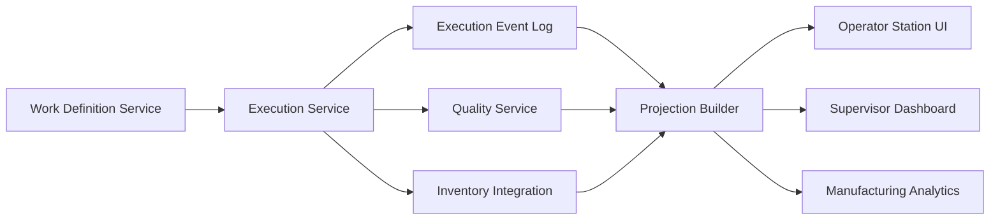

# Design An MES For Mixed-Model Production

## Example Prompt

Design the core execution system for a factory that builds multiple Anduril products or variants across shared workstations. Operators need to see work instructions, record completions, consume material, log issues, and move serialized units through the line.

## Why Anduril Would Ask This

This is probably the most direct Forge question.

The role descriptions repeatedly say:

- Forge is Anduril's custom production platform
- the team works with the factory floor directly
- the software has to support high-rate builds and real operational workflows

So this prompt tests whether you can model the heart of the plant:

- work definition
- work execution
- station flow
- operator interactions

## Manufacturing Context

If you are new to manufacturing, the important thing to understand is that an MES is the software layer that runs the actual build process.

It is where the factory answers questions like:

- what unit should this station work on next?
- what instruction applies right now?
- did the operator complete the step correctly?
- what material lot got consumed?
- can this unit move forward or is it blocked?

So if ERP is the planning brain, MES is the execution nervous system.

## What A Strong Answer Should Show

- you know the difference between planned flow and actual execution
- you can model units, work orders, routings, and stations
- you know that real factories have rework, holds, skips, and station downtime
- you care about operator simplicity and auditability

## Clarifying Questions

I would ask:

1. Are we designing for one site or many?
2. Do units move strictly linearly, or can steps branch and rework?
3. Are stations manual, automated, or both?
4. Do we need real-time dashboards in scope, or just execution?
5. How important is genealogy and material traceability in this version?

Reasonable assumption for the rest of the answer:

- one site first
- serialized units
- revisioned routings
- manual and semi-automated stations
- strong auditability required

## Why These Questions Matter

If you are not from a manufacturing background, these can sound weirdly specific.

The point is not that you should somehow magically know factory jargon.

The point is that each question changes the architecture.

### 1. Are We Designing For One Site Or Many?

What this really means:

- am I building one local system for one factory?
- or a platform that has to support multiple factories with slightly different workflows, lines, and rollout timing?

Why it matters:

- one site means simpler assumptions
- many sites means site-aware permissions, configuration, rollout, reporting, and maybe data residency or replication concerns

More human version:

- "One thing that changes the design fast is whether this is one factory or a multi-site platform, because multi-site support usually adds config and rollout complexity."

### 2. Do Units Move Strictly Linearly, Or Can Steps Branch And Rework?

What this really means:

- is the workflow basically a straight line?
- or can a unit fail, loop backward, skip ahead, or go into special handling?

Why it matters:

- linear flow can be modeled simply
- branching and rework usually pushes you toward an explicit workflow or state-machine model

More human version:

- "I want to understand how simple or messy the workflow is, because a straight-through process is very different from one with lots of rework and exception handling."

### 3. Are Stations Manual, Automated, Or Both?

What this really means:

- are humans clicking through steps?
- are machines reporting completion automatically?
- or do I need to support both?

Why it matters:

- manual stations care more about UX and operator guidance
- automated stations care more about machine integration, idempotency, and connectivity
- mixed environments are common and usually harder

More human version:

- "Another thing I’d want to clarify is how much of the workflow is human-driven versus machine-driven, because that changes both the integration model and the user experience."

### 4. Do We Need Real-Time Dashboards In Scope, Or Just Execution?

What this really means:

- am I only designing the system that records and controls execution?
- or am I also designing the visibility layer for supervisors and engineers?

Why it matters:

- execution alone is one problem
- execution plus real-time visibility adds projections, live updates, and dashboard-specific read paths

More human version:

- "I want to separate the core execution path from the reporting and visibility path, so I’d clarify whether live dashboards are in scope or whether we’re focused just on the execution system."

### 5. How Important Is Genealogy And Material Traceability In This Version?

What this really means:

- do we just need to know that a step completed?
- or do we need to know exactly which component lot, serial, operator, and test result touched this unit?

Why it matters:

- if traceability matters, the write model and storage design get more rigorous
- if it matters less, you can start with a simpler workflow system

More human version:

- "I’d also want to know how strict the traceability requirements are, because that changes whether I’m building a simple workflow tracker or a much more audit-heavy execution system."

## The Bigger Lesson

A good clarifying question is really just:

- "what answer would meaningfully change my design?"

That is all you are trying to do.

## How I Would Drive This Conversation

I would not open with "I’ll use service X and database Y."

I would open with:

- who is using the system?
- what is the unit moving through the workflow?
- what has to be true before a unit can advance?
- what must be captured for audit and traceability?

Then I would name the entities, sketch the workflow, and only after that start making concrete implementation choices.

## Main Entities

- `ProductDefinition`
- `BOMRevision`
- `RoutingRevision`
- `WorkInstructionRevision`
- `WorkOrder`
- `SerializedUnit`
- `Station`
- `StepExecution`
- `MaterialConsumption`
- `OperatorAction`
- `QualityEvent`
- `Hold`
- `ReworkLoop`

## Design Principle

Separate:

- what should happen

from:

- what actually happened

That means:

- definitions are versioned records
- executions are append-only operational events

## High-Level Architecture

### Control Plane

Responsible for:

- product definitions
- routings
- work instruction versions
- station capabilities
- user permissions
- configuration and rollout

### Execution Plane

Responsible for:

- unit movement through stations
- operator submissions
- material consumption
- test outcomes
- holds and rework
- event history

### Read Models

Optimized for:

- operator workstation UI
- supervisor line dashboard
- manufacturing engineer analytics
- quality investigation views

## Suggested Components

### 1. Work Definition Service

Stores:

- BOM revisions
- routing revisions
- work instructions
- effective dates and applicability

Why:

- definitions change less frequently
- they need review and rollout discipline

### 2. Execution Service

Handles:

- create unit under work order
- enter station
- start step
- complete step
- fail step
- route to rework

Why:

- this is the core workflow engine of the plant

### 3. Material And Inventory Integration

Handles:

- reserve material
- consume material at station
- attach lot/serial to unit
- reconcile inventory updates

Why:

- the execution event must be tied to what was actually installed

### 4. Quality Service

Handles:

- nonconformances
- holds
- release or scrap decisions
- disposition workflows

### 5. Projection / Read Model Service

Builds views for:

- current unit state
- queue at each station
- blocked units
- throughput by work order
- station performance

## Data Model Shape

### Definition-Time Tables

- `product_definition`
- `bom_revision`
- `routing_revision`
- `routing_step`
- `instruction_revision`
- `station_capability`

### Execution-Time Tables Or Events

- `work_order`
- `serialized_unit`
- `execution_event`
- `step_execution`
- `material_consumption`
- `quality_event`
- `hold`
- `rework_transition`

I would strongly favor an append-only `execution_event` stream with typed payloads and then build current state projections on top.

## Core Flows

### Normal Flow

1. Planner creates work order for product revision.
2. Units are instantiated with serial numbers.
3. Operator loads station UI and claims next unit.
4. UI shows applicable instructions and checks prerequisites.
5. Operator records completion, material usage, measurements, and attachments.
6. Execution service writes events.
7. Projection service updates unit status and next available step.

### Rework Flow

1. Step fails or quality issue is raised.
2. Quality service places hold.
3. Unit is routed to rework path.
4. Additional events record investigation and corrective actions.
5. Unit either rejoins main flow, is scrapped, or remains blocked.

## Important Tradeoffs

### State Machine Versus Ad Hoc Status Fields

I would choose:

- explicit state machine or workflow rules

Why:

- ad hoc status fields become impossible to reason about once rework and holds exist

### Event Sourcing Versus Plain Mutable Rows

I would not go full purity for every table, but I would definitely use append-only execution history for the critical plant actions.

Why:

- auditability
- root-cause analysis
- traceability
- easier reconstruction of unit history

### Synchronous Versus Asynchronous Integrations

I would keep:

- operator-critical writes synchronous to the execution service

and:

- downstream integrations async via durable events

Why:

- the operator needs a fast, authoritative answer
- ERP/WMS/analytics updates should not block station flow

## Failure Modes To Call Out

- duplicate submissions from flaky station clients
- stale instructions at the station
- inventory says material is available but it is actually quarantined
- network disruption on the floor
- work order revision changes while units are in flight

## Diagram



## SQL Sketch

```sql
create table work_order (
  id uuid primary key,
  product_code text not null,
  routing_revision_id uuid not null,
  planned_quantity int not null,
  status text not null,
  created_at timestamptz not null default now()
);

create table serialized_unit (
  id uuid primary key,
  work_order_id uuid not null references work_order(id),
  serial_number text unique not null,
  bound_routing_revision_id uuid not null,
  current_station_id uuid,
  current_state text not null,
  created_at timestamptz not null default now()
);

create table execution_event (
  id uuid primary key,
  unit_id uuid not null references serialized_unit(id),
  station_id uuid,
  event_type text not null,
  operation_key text unique not null,
  payload jsonb not null,
  created_by text not null,
  created_at timestamptz not null default now()
);

create table hold (
  id uuid primary key,
  unit_id uuid not null references serialized_unit(id),
  reason text not null,
  status text not null,
  created_at timestamptz not null default now()
);
```

## Python Sketch

```python
from dataclasses import dataclass
from enum import Enum
from typing import Any


class EventType(str, Enum):
    ENTER_STATION = "enter_station"
    COMPLETE_STEP = "complete_step"
    FAIL_STEP = "fail_step"
    CONSUME_MATERIAL = "consume_material"
    PLACE_HOLD = "place_hold"


@dataclass
class ExecutionEvent:
    unit_id: str
    event_type: EventType
    operation_key: str
    station_id: str | None
    created_by: str
    payload: dict[str, Any]


class ExecutionService:
    def enter_station(self, unit_id: str, station_id: str, operator_id: str, operation_key: str) -> None:
        self._append_event(
            ExecutionEvent(
                unit_id=unit_id,
                event_type=EventType.ENTER_STATION,
                operation_key=operation_key,
                station_id=station_id,
                created_by=operator_id,
                payload={},
            )
        )

    def complete_step(self, unit_id: str, station_id: str, operator_id: str, operation_key: str, measurements: dict[str, Any]) -> None:
        self._append_event(
            ExecutionEvent(
                unit_id=unit_id,
                event_type=EventType.COMPLETE_STEP,
                operation_key=operation_key,
                station_id=station_id,
                created_by=operator_id,
                payload={"measurements": measurements},
            )
        )

    def _append_event(self, event: ExecutionEvent) -> None:
        # Persist event and trigger async projections/integrations.
        pass
```

## Practical Stack Choices

If I were grounding this in a pragmatic AWS-style implementation, I would probably start with:

- a React or Next.js frontend for operator and supervisor workflows
- backend services on ECS/Fargate
- CDK for infrastructure
- Postgres or Aurora Postgres for the system of record
- SQS or Kinesis for async integration paths depending on whether I want simple queues or event streaming

I would not start with DynamoDB as the primary store here because the workflow, revisioning, holds, and execution history are naturally relational.

I might add OpenSearch later for:

- fast unit lookup
- searching by serial, station, operator, or hold reason

but I would keep the authoritative truth in SQL.

## What I Would Say About Availability

The plant cannot stop because a nice microservice diagram looked elegant.

So I would explicitly design:

- local buffering or resilient station clients where appropriate
- idempotent execution APIs
- strong observability around station health and failed writes
- degraded mode for read-only or retry-safe operations

## What Makes This A Staff-Level Answer

The staff-level version is not just "I’ll build services."

It is:

- I know the plant is a live state machine
- I know current state and history are both first-class
- I know mixed revisions and rework are normal
- I know operator UX and uptime matter as much as backend elegance

## 5-Minute Answer

"I’d model this as a manufacturing execution system with a strict split between planned definitions and actual execution. On the definition side I’d version BOMs, routings, work instructions, and station capabilities. On the execution side I’d treat each serialized unit as moving through a workflow, with append-only events recording station entry, completion, material consumption, test outcomes, holds, and rework.

The core service would manage unit progression and enforce workflow rules, while read models would power the operator station UI and supervisor dashboards. I’d keep operator-facing writes synchronous and authoritative, but push inventory sync, analytics, and downstream integrations asynchronously off durable events.

The big things I’d design for are mixed revisions, idempotent station actions, quality holds, and rework loops. The mistake to avoid is modeling this with a few mutable status fields, because that breaks down as soon as the factory gets messy."

## 15-Minute Answer

"I’d model this as a manufacturing execution system with a clear split between definition-time data and execution-time data. On the definition side, I’d version product definitions, BOMs, routings, work instructions, and station capabilities. On the execution side, I’d treat each serialized unit moving through the plant as a stateful object whose history is captured through append-only execution events.

The core workflow service would manage unit progression through stations, material consumption, test results, and quality events. I would not rely on a handful of mutable status fields because the moment we introduce rework, holds, skips, or mixed revisions, those models collapse. Instead, I’d keep durable execution events and build read models for the operator UI, supervisor dashboards, and manufacturing engineering views.

For operator actions like start step, complete step, or consume material, I’d make the APIs idempotent and synchronous to the execution service, because the station needs an authoritative result immediately. Downstream integrations to inventory, analytics, and other business systems can happen asynchronously from durable events. I’d also treat material traceability and quality as first-class, because in a real factory they are not optional side workflows.

The main risks I’d design around are stale instructions at stations, duplicate submissions from flaky clients, and revision changes while units are already in flight. So I’d bind units or work orders to explicit revisions once execution starts, support mixed revision operation, and keep the operator path simple even if the backend model is more rigorous."

## Short Answer Summary

I would design Forge MES around versioned work definitions, append-only execution events, explicit workflow/state transitions for serialized units, and read-optimized views for operators and supervisors. The system would treat quality, material consumption, and rework as first-class parts of execution, not afterthoughts.
