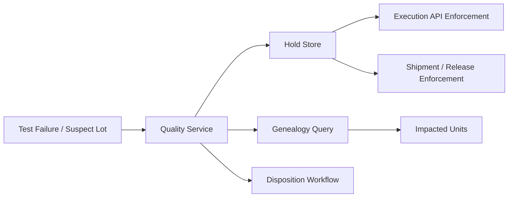

# Design Quality Hold And Rework Management

## Example Prompt

A unit fails at test, or a material lot is later found suspect. Design the system that places affected items on hold, blocks downstream work, routes investigation, and supports rework, release, or scrap.

## Why Anduril Would Ask This

This is where execution, quality, and traceability collide.

Anduril’s software cannot just move units forward quickly.

It also has to:

- stop bad units from escaping
- understand blast radius
- support corrective action
- preserve an auditable history

## Manufacturing Context

In manufacturing, quality is not just "file a bug."

A quality issue can mean:

- stop this unit immediately
- quarantine a whole lot of material
- prevent shipment
- reroute work into investigation or rework

So quality workflows are really control mechanisms on the flow of physical hardware.

That is a very real production software problem.

## Core Insight

Do not treat quality as a side workflow.

It has to be deeply integrated with:

- execution state
- genealogy
- inventory status
- operator permissions

## Main Concepts

- `QualityEvent`
- `Hold`
- `Disposition`
- `AffectedEntity`
- `BlastRadius`
- `ReworkPlan`
- `ReleaseDecision`

`AffectedEntity` could be:

- serialized unit
- subassembly
- component lot
- work order slice

## Flow

### Failure At Station

1. Test or operator reports failure.
2. Quality event is created.
3. Execution system places hold on unit.
4. Unit is blocked from downstream station progression.
5. Quality workflow determines disposition.

### Suspect Lot Discovery

1. Lot is marked suspect.
2. Genealogy service computes impacted units and assemblies.
3. Hold service propagates hold to affected entities.
4. Dashboards and execution APIs reflect blocked status.
5. Investigation and release decisions proceed.

## Architecture

### Quality Service

Owns:

- quality event lifecycle
- hold records
- disposition workflow
- approvals

### Genealogy Integration

Needed for:

- blast-radius computation
- where-used analysis

### Execution Integration

Needed for:

- enforcing blocks at station progression
- routing rework
- preventing shipment or completion

### Notification / Escalation

Needed for:

- supervisors
- quality engineers
- manufacturing engineers

## Strong Design Choices

### Policy Engine For Hold Severity

Not every issue has the same impact.

Examples:

- advisory warning
- local station block
- full unit hold
- lot quarantine
- shipment stop

### Explicit Disposition States

Examples:

- pending investigation
- rework approved
- use-as-is approved
- scrap
- released

### Hard Enforcement In APIs

Do not rely only on UI banners.

Execution APIs should reject actions that violate active holds.

## Tradeoffs

### Automatic Propagation Versus Manual Review

I would support both:

- immediate automated safe hold
- followed by human review for final blast radius and disposition

Why:

- speed matters when bad material is discovered
- humans are still needed for nuanced decisions

### Strong Consistency Versus Async Propagation

I would make the initial hold durable synchronously, then allow some downstream propagation and reporting views to update asynchronously.

## Failure Modes

- hold exists in quality system but station UI does not reflect it yet
- duplicate or conflicting dispositions
- genealogy is incomplete, leading to under-blocking
- released unit remains blocked in one downstream system

## Diagram



## SQL Sketch

```sql
create table quality_event (
  id uuid primary key,
  entity_type text not null,
  entity_id uuid not null,
  event_type text not null,
  severity text not null,
  payload jsonb not null,
  created_at timestamptz not null default now()
);

create table active_hold (
  id uuid primary key,
  entity_type text not null,
  entity_id uuid not null,
  reason text not null,
  status text not null,
  created_at timestamptz not null default now()
);

create table disposition_decision (
  id uuid primary key,
  hold_id uuid not null references active_hold(id),
  decision text not null,
  decided_by text not null,
  decided_at timestamptz not null default now(),
  notes text
);
```

## Python Sketch

```python
class QualityService:
    def place_hold(self, entity_type: str, entity_id: str, reason: str) -> str:
        # Persist durable hold and emit downstream enforcement event.
        return "hold-id"

    def release_hold(self, hold_id: str, decided_by: str, notes: str) -> None:
        # Record explicit release decision for auditability.
        pass


class ExecutionPolicy:
    def can_advance(self, entity_id: str) -> bool:
        # Reject station progression if a live hold exists.
        return False
```

## What Makes This A Staff-Level Answer

You are showing:

- quality is not a sidecar
- blast radius depends on genealogy
- execution enforcement matters
- release paths must be explicit and auditable

## 5-Minute Answer

"I’d design quality hold and rework as a first-class workflow integrated with execution and genealogy. When a unit fails test or a component lot is flagged, the first step is immediate safe containment through a durable hold that downstream systems must enforce.

The quality service would own events, holds, investigations, dispositions, and releases. For local failures it may block one unit; for a suspect lot it would use genealogy to compute blast radius and propagate holds to affected work. I’d support explicit disposition states like pending investigation, rework, scrap, release, and use-as-is.

The main design point is that this cannot live only in the UI. Execution and shipment APIs need to enforce holds so blocked hardware cannot move forward by accident." 

## 15-Minute Answer

"I’d design quality hold and rework management as a first-class workflow integrated directly with execution and genealogy. When a unit fails test or a component lot is later flagged as suspect, the first priority is safe containment. So I’d make hold creation a durable, authoritative action that execution systems must respect immediately.

The quality service would manage the lifecycle of quality events, holds, investigations, dispositions, and release decisions. For local failures, that may just block one serialized unit. For a suspect lot, I’d use the genealogy system to compute blast radius and propagate holds to affected units or subassemblies. I would support different hold severities, from advisory warnings to full shipment blocks.

I would not rely on UI warnings alone. Station and shipment APIs should enforce active holds so the system cannot accidentally advance blocked work. At the same time, I’d make the initial hold fast and safe, and let some propagation, reporting, and notification updates happen asynchronously.

The key tradeoff is balancing fast containment with human review. I’d prefer immediate conservative holds, then allow quality engineers to decide whether to rework, release, scrap, or use-as-is. Every one of those decisions should be auditable, because this workflow is ultimately about preventing bad hardware from moving forward while preserving a trustworthy history of what happened and why." 

## Short Answer Summary

I would design quality hold and rework management as a first-class workflow connected to MES execution, genealogy, and inventory status. The system would support immediate safe holds, blast-radius analysis, explicit disposition states, API-level enforcement, and full audit history for every release, rework, or scrap decision.
