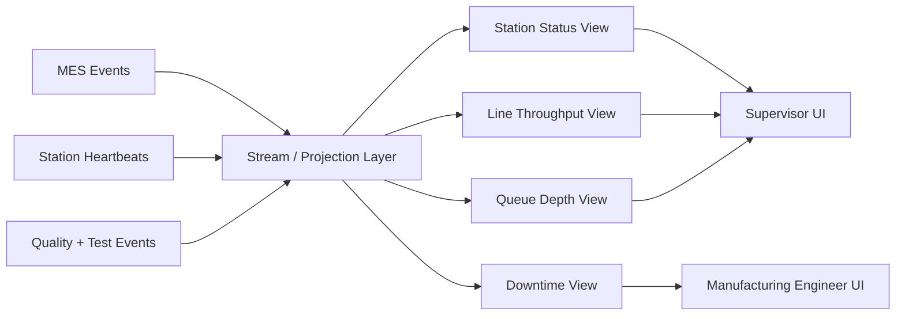

# Design Real-Time Factory Visibility

## Example Prompt

Design a real-time operational dashboard for a factory. Supervisors need live visibility into throughput, station status, queue depth, blockers, yield, and downtime across multiple lines.

## Why Anduril Would Ask This

This is the natural observability side of Forge.

Anduril’s factory software stack likely needs to answer:

- what is running now?
- what is blocked?
- where is the bottleneck?
- what changed in the last hour?

This is an internal-platform problem with operational consequences.

## Manufacturing Context

Factory visibility is not just a prettier metrics dashboard.

It is how line leads and manufacturing engineers decide:

- where the bottleneck is
- whether a station is truly down or just silent
- whether WIP is piling up
- whether yield is drifting
- which issue deserves intervention right now

So this is observability, but with direct impact on throughput and labor coordination.

## Core Insight

Do not make the dashboard read raw transactional tables directly.

The right shape is:

- event-driven execution data
- projections or materialized views for operational read paths

## What Users Need

### Supervisor

- line health
- queue depth
- units completed this shift
- blocked stations
- downtime reasons

### Manufacturing Engineer

- cycle-time distributions
- station bottlenecks
- rework hotspots
- yield trends

### Operator Lead

- which units are waiting
- what station is down
- who is blocked and why

## How I Would Drive This Conversation

I would first clarify:

- who needs the dashboard
- whether they care more about current state or historical investigation
- how fresh the data really needs to be
- what actions they need to take off the dashboard

Then I would separate:

- source-of-truth event producers
- projection builders
- read APIs
- live update path to the UI

## Architecture

### Event Sources

- execution events from MES
- station heartbeat and automation telemetry
- quality events
- inventory exceptions
- test bench results

### Stream Processing / Projection Layer

Build projections for:

- current station state
- unit counts by step
- queue depth between stations
- line throughput
- first-pass yield
- downtime events and durations

### Read APIs

Provide:

- line summary endpoint
- station detail endpoint
- unit trace endpoint
- downtime history endpoint

### Client Update Strategy

Use:

- websocket or server-sent events for active dashboards

Fallback:

- polling for less critical views

## Data Model

Raw:

- `execution_event`
- `station_heartbeat`
- `quality_event`
- `test_event`

Projections:

- `line_status_view`
- `station_status_view`
- `throughput_view`
- `queue_depth_view`
- `downtime_view`

## Important Design Choices

### Derived State Versus Source Of Truth

The dashboard should not be the source of truth.

It should read from durable source events and projection tables.

Why:

- current operational state is derived
- raw sources may arrive out of order
- the dashboard needs performance and stability

### Freshness Versus Correctness

I would talk explicitly about this tradeoff.

Examples:

- line health can be near-real-time with slight lag
- genealogy or audit investigation can tolerate slower but exact queries

### Staleness Signaling

Show:

- last update time
- stale data warnings
- disconnected station markers

Never pretend stale data is live.

## Failure Modes

- heartbeat spam floods the system
- one station goes silent but is not truly down
- event ordering is inconsistent
- dashboard projections lag behind by several minutes

## Diagram



## SQL Sketch

```sql
create table station_heartbeat (
  station_id text not null,
  observed_at timestamptz not null,
  status text not null,
  payload jsonb not null,
  primary key (station_id, observed_at)
);

create table operational_event (
  id uuid primary key,
  source text not null,
  entity_id text not null,
  event_type text not null,
  payload jsonb not null,
  created_at timestamptz not null default now()
);

create table station_status_view (
  station_id text primary key,
  current_status text not null,
  blocked_unit_count int not null,
  last_heartbeat_at timestamptz,
  updated_at timestamptz not null
);
```

## Python Sketch

```python
from dataclasses import dataclass
from typing import Any


@dataclass
class StationStatus:
    station_id: str
    current_status: str
    blocked_unit_count: int
    last_heartbeat_at: str | None


class ProjectionBuilder:
    def handle_event(self, event_type: str, payload: dict[str, Any]) -> None:
        if event_type == "station_heartbeat":
            self._update_station_status(payload)
        elif event_type == "unit_blocked":
            self._increment_blocked(payload["station_id"])
        elif event_type == "unit_unblocked":
            self._decrement_blocked(payload["station_id"])

    def _update_station_status(self, payload: dict[str, Any]) -> None:
        pass

    def _increment_blocked(self, station_id: str) -> None:
        pass

    def _decrement_blocked(self, station_id: str) -> None:
        pass
```

## Practical Stack Choices

A practical implementation could look like:

- event producers writing into Kinesis or Kafka
- projection services on ECS/Fargate
- Postgres or DynamoDB for current-state projections depending on query shape
- OpenSearch for fast faceted search and operational filtering
- websockets or SSE from a backend-for-frontend layer to the UI

If this were heavily AWS-centric and I wanted to move quickly, I would probably prefer:

- Kinesis
- Lambda or Fargate for projection updates
- Postgres for relational summaries
- OpenSearch only if search/filter UX becomes important

I would avoid making the dashboard depend directly on raw event tables.

## Strong Answer Additions

- anomaly detection later for station drift or queue growth
- role-based views because supervisors and engineers need different abstractions
- historical playback for shift review and root-cause analysis

## 5-Minute Answer

"I’d design this as an observability layer on top of execution and telemetry systems rather than a dashboard that queries raw operational tables directly. MES events, station heartbeats, quality events, and test results would flow into a projection layer that materializes current station health, queue depth, throughput, downtime, and blocked work.

I’d keep the source-of-truth writes in the plant systems and build low-latency read models for supervisors and engineers. Active dashboards could use websockets or server-sent events, but I’d always expose freshness indicators so users know when data is stale.

The main design tradeoff is freshness versus correctness. Supervisors want near-real-time visibility, but the system also needs a trustworthy path back to raw history for investigation and quality work." 

## 15-Minute Answer

"I’d design factory visibility as an observability layer on top of execution and telemetry systems, not as a UI that directly queries transactional tables. The raw inputs would be MES execution events, station heartbeat events, quality events, and test telemetry. From those, I’d build materialized views for current station status, line throughput, queue depth, downtime, and blocked units.

I’d separate the write path from the read path. The write path is the authoritative event stream coming from plant systems. The read path is a projection layer optimized for low-latency dashboards. That lets us support real-time views for supervisors without putting heavy analytical queries on the operational systems that run the plant.

On the frontend side, I’d expose role-specific views. Supervisors need a live summary of line health and blockers. Manufacturing engineers need more diagnostic and historical views like cycle-time distributions, yield drift, and rework hotspots. I’d use websockets or server-sent events for active dashboards, but I’d also surface freshness indicators so users know when a station or projection is stale.

The main design tradeoff here is freshness versus correctness. Some views can be near-real-time with slight lag, but when people are investigating a quality event, I’d rather give them a slower but correct path back to raw history. I’d also explicitly design for out-of-order events and silent stations so the dashboard doesn’t lie just because telemetry is delayed." 

## Short Answer Summary

I would design factory visibility as an observability system built on top of MES execution events and station telemetry, with a projection layer that materializes line and station health into low-latency read models. The design would prioritize trustworthy operational state, explicit freshness indicators, and role-specific dashboards rather than raw-table querying.
