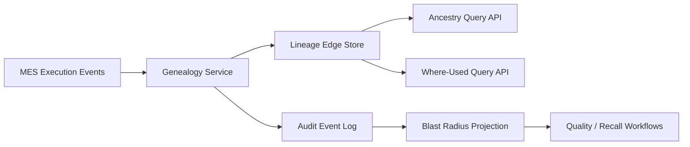

# Design Traceability And Genealogy

## Example Prompt

Design a system that can answer, for any shipped serialized unit:

- which component lots and serials were used
- which operators touched it
- what tests it passed or failed
- which process revisions and instructions were active when it was built

## Why Anduril Would Ask This

This is one of the most manufacturing-native and most important problems in the whole stack.

Defense hardware needs:

- traceability
- auditability
- fast root-cause investigation
- accurate recall and blast-radius analysis

If something fails in the field or a component lot is later found suspect, this system is how you answer:

- what is affected?
- what is safe?
- what needs to be held?

## Manufacturing Context

This is the domain where manufacturing software becomes very unlike normal business software.

If a part lot turns out to be bad weeks later, the company needs to know:

- which exact units used it
- whether those units shipped
- what subassemblies are affected
- whether the issue is contained or widespread

That is why genealogy is so central. It is the system’s memory of physical reality.

## Core Insight

Genealogy is not just metadata.

It is a graph of relationships built over time.

You need to know:

- what was attached to what
- when
- under which process
- by whom

## Main Data To Capture

- top-level serialized unit
- subassembly serials
- lot-tracked materials
- consumables
- operator identity
- station identity
- instruction revision
- process revision
- test results
- nonconformances

## Data Model Shape

I would model this with:

- immutable lineage edges
- append-only event history
- materialized ancestry views for common queries

Examples:

- `unit_built_from_component`
- `unit_processed_at_station`
- `unit_tested_with_result`
- `unit_touched_by_operator`
- `unit_built_under_revision`

You can implement this as relational edge tables and event logs rather than needing a dedicated graph database at first.

## Key APIs / Queries

- given top-level serial, show full ancestry
- given suspect component lot, show all impacted units
- given unit, show all failed tests and rework history
- given revision, show which units were built under it
- given operator or station, show which units were processed there

## How I Would Drive This Conversation

I would start by clarifying:

- what the most important investigation queries are
- whether we need both forward and backward traceability
- what the unit of traceability is: lot, serial, subassembly, or all of them
- whether corrections must preserve original history

Then I would explain that this is fundamentally a lineage problem with audit requirements, which means the write model and query model both matter.

## Suggested Architecture

### Execution Integration

Every material consumption, attachment, and test event emitted by MES should create durable lineage records.

### Genealogy Service

Responsible for:

- writing lineage edges
- validating attachment semantics
- exposing ancestry and where-used queries

### Projection Layer

Builds faster views for:

- full unit history
- suspect lot blast radius
- genealogy search by serial or lot

## Hard Parts

### Lot Versus Serial Tracking

Some components are individually serialized.

Some are only lot tracked.

Your model must support both without becoming ambiguous.

### Corrections

Humans make mistakes.

So you need:

- correction records
- voided events
- superseding lineage edges

But not destructive deletion of history.

### Partial Assemblies

A subassembly can be built, tested, held, then later attached upstream.

That means the genealogy graph grows incrementally over time.

## Tradeoffs

### Graph Database Or Relational Model

I would start with:

- relational storage plus edge tables and indexed event history

Why:

- operational teams already need transactional guarantees
- common lineage queries are known in advance
- it is simpler to integrate with the rest of the platform

If the query complexity explodes later, a specialized graph representation can be added for analytics.

### Strict Synchronous Writes Or Async Pipeline

I would require the authoritative lineage event to be durably recorded as part of the execution flow, but heavy projections and cross-system propagation can be async.

## Failure Modes

- material scanned incorrectly
- same component attached twice by retry
- lot gets quarantined after downstream consumption
- upstream system changes revision labels unexpectedly

## Diagram



## SQL Sketch

```sql
create table traceable_object (
  id uuid primary key,
  object_type text not null,
  external_ref text not null,
  created_at timestamptz not null default now()
);

create table lineage_edge (
  id uuid primary key,
  parent_object_id uuid not null references traceable_object(id),
  child_object_id uuid not null references traceable_object(id),
  edge_type text not null,
  source_event_id uuid not null,
  created_at timestamptz not null default now()
);

create table audit_event (
  id uuid primary key,
  object_id uuid not null references traceable_object(id),
  event_type text not null,
  payload jsonb not null,
  created_at timestamptz not null default now()
);
```

## Python Sketch

```python
from dataclasses import dataclass


@dataclass
class LineageEdge:
    parent_object_id: str
    child_object_id: str
    edge_type: str
    source_event_id: str


class GenealogyService:
    def attach_component(self, unit_id: str, component_id: str, source_event_id: str) -> None:
        edge = LineageEdge(
            parent_object_id=unit_id,
            child_object_id=component_id,
            edge_type="built_from",
            source_event_id=source_event_id,
        )
        self._write_edge(edge)

    def where_used(self, component_id: str) -> list[str]:
        # Return all downstream units impacted by this component or lot.
        return []

    def _write_edge(self, edge: LineageEdge) -> None:
        pass
```

## Practical Stack Choices

For this kind of system, I would default to:

- Postgres or Aurora Postgres for lineage edges and audit events
- CDC or event streaming into downstream projections
- OpenSearch for investigator-facing search over serials, lots, operators, and revisions

I would not jump straight to a graph database unless:

- the relationship complexity is clearly overwhelming SQL
- and the team actually has the operational appetite for it

For an interview answer, "relational source of truth plus indexed edge tables plus search projections" is usually the most grounded answer.

## What Makes This Answer Good

A good answer shows you understand:

- this is immutable history
- blast radius queries matter
- quality workflows depend on this system
- convenience edits cannot erase reality

## 5-Minute Answer

"I’d design genealogy as an append-only lineage system directly tied to manufacturing execution. Every meaningful plant action like material consumption, component attachment, station completion, test execution, or revision application would create durable records and lineage edges between units, subassemblies, lots, operators, and process revisions.

I’d optimize for two core queries: given a unit, show how it was built; and given a suspect lot, show what else is affected. I’d likely start with relational edge tables and indexed event history rather than a separate graph database, then build projections for common ancestry and where-used queries.

The key principle is that history cannot be overwritten for convenience. Corrections should be additive, auditable, and still preserve what happened originally." 

## 15-Minute Answer

"I’d design genealogy as a first-class lineage system tied directly to manufacturing execution. Every meaningful action during build and test would emit durable events: material consumed, component attached, station completed, test executed, hold placed, and revision applied. From those events I’d create explicit lineage edges between top-level serialized units, subassemblies, lots, operators, stations, and process revisions.

I would not treat this as a loose metadata table because the real questions are graph-shaped: given a shipped unit, what exactly went into it; and given a suspect lot, what else is affected? So I’d model immutable relationships over time and preserve corrections through superseding records rather than destructive edits.

I’d probably start with relational storage and indexed edge tables rather than a separate graph database, because the operational query patterns are fairly clear and the rest of the manufacturing stack is likely already transactional. On top of that I’d build projections for common queries like full unit ancestry, where-used by lot, failed-test history, and revision lookup.

The main risks are bad scans, duplicate attachments from retries, and retroactive quality discoveries. That means writes need strong identity and idempotency, and the system has to support blast-radius analysis when a lot is later quarantined. The key principle is that history must remain reconstructable even when humans make mistakes." 

## Short Answer Summary

I would design genealogy as an append-only lineage model tied directly to execution events, with explicit relationships between serialized units, component lots, operators, stations, tests, and revisions. The system would optimize for auditability, suspect-lot blast-radius queries, and faithful reconstruction of how a unit was actually built.
