# Algorithm Framework For Medium And Hard Problems

This doc is about one skill: seeing a new problem and narrowing it to the right algorithm family quickly.

The goal is not to memorize 300 problems. The goal is to build a compact mental graph:

- what structure the problem has
- what kind of question is being asked
- which pattern matches that structure
- what extra constraint pushes you toward one algorithm over another

## The Main Idea

Most medium and hard problems are not random. They usually reduce to one of a small number of structures:

- array or string scan
- set or map lookup
- sorted order
- contiguous window
- interval interaction
- tree traversal
- graph reachability
- dependency ordering
- optimization over choices
- repeated overlapping subproblems

The hard part is not coding syntax. The hard part is identifying the hidden structure.

## The Mental Model

For each problem, answer these five questions before writing code:

1. What is the input structure?
2. What is the output asking for?
3. What operation is repeated many times?
4. What constraint rules out the naive solution?
5. What information must I remember while scanning or searching?

Those five answers usually tell you the algorithm family.

## The Knowledge Graph

Think of the main patterns as connected, not isolated.

```mermaid
graph TD
    A["New Problem"] --> B["Array / String"]
    A --> C["Tree / Graph"]
    A --> D["Intervals / Events"]
    A --> E["Optimization / Counting"]

    B --> B1["Hash Map / Set"]
    B --> B2["Two Pointers"]
    B --> B3["Sliding Window"]
    B --> B4["Prefix Sum"]
    B --> B5["Binary Search"]
    B --> B6["Monotonic Stack / Queue"]

    C --> C1["DFS / BFS"]
    C --> C2["Topological Sort"]
    C --> C3["Union Find"]
    C --> C4["Shortest Path"]
    C --> C5["Trie / Backtracking"]

    D --> D1["Sort + Merge"]
    D --> D2["Sweep Line"]
    D --> D3["Heap Scheduling"]

    E --> E1["Greedy"]
    E --> E2["Dynamic Programming"]
    E --> E3["Heap / Priority Queue"]
    E --> E4["Memoized Search"]
```



A lot of progress comes from learning the edges between these nodes:

- sorted array problems often become two pointers or binary search
- contiguous subarray problems often become sliding window or prefix sum
- connectivity problems become DFS, BFS, or union find
- dependency problems become topological sort
- “minimum steps” on an implicit state space often becomes BFS
- “best possible value under choices” often becomes DP or greedy

## First Cut: Classify The Problem

Use this checklist.

### 1. Is it about fast membership, counting, or grouping?

Signals:

- “find duplicates”
- “count frequencies”
- “group by”
- “have we seen this before?”
- “lookup by key/value”

Likely tools:

- hash map
- set
- `Counter`
- `defaultdict`

Core principle:

Replace repeated linear search with constant-time lookup.

## 2. Is it about a contiguous subarray or substring?

Signals:

- “longest substring”
- “subarray sum”
- “window”
- “contiguous”
- “at most k”
- “exactly k”

Likely tools:

- sliding window
- prefix sums
- hash map over prefix sums

Core principle:

When the region must stay contiguous, the problem is often about how to maintain enough state while expanding or shrinking a window.

Quick rule:

- use sliding window when the window can be adjusted locally
- use prefix sums when you need fast range totals or exact subarray relationships

## 3. Is the data sorted, or can sorting create order that simplifies the problem?

Signals:

- “closest”
- “pair/triplet”
- “merge”
- “overlap”
- “kth”
- “smallest/largest”

Likely tools:

- sorting
- two pointers
- binary search
- heap

Core principle:

Sorting often turns a combinatorial problem into a structured scan.

## 4. Is it about intervals, meetings, or time ranges?

Signals:

- start/end times
- overlap
- merge intervals
- meeting rooms
- calendar
- timeline

Likely tools:

- sort + merge
- sweep line
- heap

Core principle:

Order all events and process changes as they happen.

## 5. Is it a tree, graph, or hidden graph?

Signals:

- nodes and edges
- connected components
- shortest path
- transformations between states
- dependencies
- grid traversal
- word ladder style state changes

Likely tools:

- DFS
- BFS
- union find
- Dijkstra
- topological sort

Core principle:

Many problems are graphs even when they do not look like graphs at first.

Examples of hidden graphs:

- each string is a node, one edit apart is an edge
- each grid cell is a node, adjacent moves are edges
- each game state is a node, legal moves are edges

## 6. Is the problem asking for the best, minimum, maximum, or number of ways?

Signals:

- “minimum cost”
- “maximum score”
- “how many ways”
- “can we optimize”
- “choose among options”

Likely tools:

- greedy
- dynamic programming
- memoized DFS
- shortest path if transitions have costs

Core principle:

Optimization problems usually hinge on whether a local best choice is enough or whether future choices matter.

Quick rule:

- use greedy when a local decision can be proven safe
- use DP when choices interact across subproblems

## 7. Is it asking for a valid ordering under prerequisites?

Signals:

- prerequisites
- dependency graph
- build order
- course schedule
- alien dictionary

Likely tools:

- topological sort
- DFS cycle detection
- indegree + queue

Core principle:

This is almost always a DAG ordering problem unless there is a cycle.

## 8. Is it asking whether elements belong to the same group over time?

Signals:

- connectivity
- union/merge
- friend circles
- accounts merge
- redundant connection

Likely tools:

- union find
- DFS/BFS

Core principle:

When the main operation is repeatedly merging groups, union find is often the cleanest solution.

## 9. Is the search space exponential, but overlapping states repeat?

Signals:

- recursion feels natural
- brute force tries many branches
- same state is recomputed
- decision depends on position plus a few parameters

Likely tools:

- memoization
- dynamic programming
- bitmask DP in rare cases

Core principle:

Cache by state.

## 10. Is it about nearest greater/smaller or maintaining monotonic behavior?

Signals:

- next greater element
- daily temperatures
- largest rectangle
- sliding window max
- maintain increasing/decreasing property

Likely tools:

- monotonic stack
- monotonic queue

Core principle:

Use a data structure that keeps only candidates that can still matter.

## The Fast Decision Tree

When you see a problem, run this in order:

1. Can I solve it with a plain hash map or set?
2. Is the answer about a contiguous region?
3. Would sorting expose useful structure?
4. Is this really an interval problem?
5. Is this actually a graph or tree problem?
6. Is the question about optimization or counting?
7. Do repeated states suggest DP?
8. Do I need a heap because I keep asking for min/max dynamically?
9. Is there a monotonic property I can exploit?

This is a much better default than jumping straight to DP or graph algorithms.

## A Better Way To Think About Difficulty

Hard problems are often just combinations of medium patterns.

Common combinations:

- hash map + prefix sum
- sorting + two pointers
- graph traversal + heap
- DFS + memoization
- binary search + greedy check
- interval sort + heap
- trie + backtracking
- DP + monotonic queue

So instead of asking, “What trick is this?”

Ask:

- what is the base structure?
- what extra constraint is layered on top?

## The Four Most Important Transformations

These transformations crack a huge percentage of problems.

### 1. Brute force search becomes lookup

Before:

- repeatedly scan for matches

After:

- store prior information in a set or map

### 2. Pairwise comparison becomes ordered scan

Before:

- compare many pairs or ranges

After:

- sort first, then sweep once

### 3. Exponential recursion becomes cached state search

Before:

- branch on all choices

After:

- define the state and memoize it

### 4. Explicit objects become graph states

Before:

- problem looks domain-specific

After:

- define node, edge, and transition cost

## The Framework For Solving A New Problem

Use this sequence every time.

### Step 1: Restate the problem in one sentence

Example:

- “I need the longest contiguous segment satisfying a constraint.”
- “I need the cheapest way to move through a state space.”
- “I need to merge overlapping ranges.”

If you can restate it clearly, the pattern usually starts to appear.

### Step 2: Write the brute force idea

This matters because:

- it clarifies correctness
- it shows what is repeated too often
- it exposes the bottleneck

### Step 3: Name the bottleneck

Typical bottlenecks:

- repeated membership checks
- repeated recomputation
- repeated range sums
- repeated min/max extraction
- repeated traversal of the same states

### Step 4: Replace the bottleneck with the right structure

Examples:

- membership check -> set
- counts/grouping -> map
- repeated range sum -> prefix sum
- repeated min/max -> heap or monotonic structure
- repeated state recomputation -> memoization
- repeated graph exploration -> visited set

### Step 5: State the invariant

This is the highest-leverage interview habit.

Examples:

- “the window always satisfies the constraint”
- “the heap contains the next valid candidates”
- “the stack is monotonic decreasing”
- “`dp[i]` means the best answer up to index `i`”
- “visited nodes are already fully processed”

If your invariant is solid, your code becomes much easier to trust.

## The Core Pattern Catalog

This is the smallest pattern set worth mastering first.

### Arrays And Strings

- hash map / set
- two pointers
- sliding window
- prefix sum
- binary search
- monotonic stack

### Trees And Graphs

- DFS
- BFS
- topological sort
- union find
- Dijkstra
- trie + DFS/backtracking

### Optimization

- greedy
- memoization
- bottom-up DP
- heap

### Range And Event Problems

- sort + merge
- sweep line
- heap scheduling

## When To Reach For Each Pattern

### Hash Map / Set

Reach for it when:

- you need fast lookup
- you need counts
- you need deduplication
- you need to remember prior states

### Two Pointers

Reach for it when:

- data is sorted
- you need pair relationships
- you can move boundaries intelligently

### Sliding Window

Reach for it when:

- the answer is a contiguous region
- you can update the state incrementally as the window moves

### Prefix Sum

Reach for it when:

- many questions are about subarray totals or balances
- exact relationships between prefixes matter

### BFS

Reach for it when:

- edges are unweighted
- you need minimum number of steps
- layers matter

### DFS

Reach for it when:

- you need full traversal
- backtracking is needed
- recursive structure is natural

### Union Find

Reach for it when:

- the core operation is merging components
- connectivity after many unions matters

### Heap

Reach for it when:

- you need the next smallest or largest repeatedly
- priorities change over time
- you are scheduling or processing streams

### DP

Reach for it when:

- the answer depends on smaller subproblems
- choices now affect future options
- subproblems overlap

### Greedy

Reach for it when:

- a local choice can be proven globally safe
- sorting reveals a clean selection rule

## The DP Recognition Framework

DP deserves its own recognition test because people overuse it.

Use DP when all three are true:

1. There is a state that fully summarizes the future-relevant information.
2. The answer can be built from smaller states.
3. Many states repeat.

A good DP question to ask:

- “If I freeze the world at position `i` with state `s`, what is the best answer from here?”

That gives you memoized DFS or bottom-up DP.

## The Graph Recognition Framework

A problem is a graph problem if you can define:

- node: what a state is
- edge: what transition is allowed
- weight: what moving costs, if anything

Then:

- unweighted shortest path -> BFS
- weighted shortest path with nonnegative edges -> Dijkstra
- full reachability / components -> DFS or BFS
- dependency ordering -> topological sort

## The Binary Search Recognition Framework

Binary search is not just for sorted arrays.

Use it when:

- the answer space is ordered
- you can check whether a candidate answer is feasible
- feasibility is monotonic

Classic form:

- “Can we achieve answer `x`?”
- if yes, maybe all smaller values also work
- if no, maybe all larger values are required

This is binary search on the answer.

## The Real Study Goal

Do not aim to memorize solutions problem by problem.

Aim to memorize:

- the recognition signals
- the invariant for each pattern
- the common implementation skeleton
- the failure modes of each pattern

That is what transfers to unseen problems.

## Recommended Practice Order

Study in layers.

### Layer 1: Single-pattern fluency

Master these first:

- hash map / set
- two pointers
- sliding window
- prefix sum
- DFS / BFS
- heap
- intervals
- binary search

### Layer 2: Structural patterns

- union find
- topological sort
- monotonic stack / queue
- trie
- memoization / DP

### Layer 3: Combined patterns

- BFS + state compression
- binary search + greedy
- DP + prefix sums
- heap + intervals
- graph + DP

## What To Do During An Interview

When you get stuck, do not hunt for tricks. Reset with structure:

1. What is the shape of the input?
2. Is the region contiguous or arbitrary?
3. Is order important, or can I create order by sorting?
4. Am I exploring states or scanning data?
5. Is this really connectivity, shortest path, or dependencies?
6. Are there repeated subproblems?
7. What invariant would make the solution easy to trust?

If you answer those clearly, the algorithm usually stops feeling mysterious.

## Final Heuristic

Most problems yield to one of these moves:

- store information
- impose order
- shrink the search space
- model states explicitly
- cache repeated work

That is the framework.

## Python Skeletons You Can Actually Use

This section turns the framework into code.

The goal is not to memorize every line. The goal is to remember:

- when to reach for the pattern
- the invariant
- the minimal Python skeleton

## 1. Hash Map And Set

Use when:

- you need fast lookup
- you need counts
- you need grouping

Invariant:

- the map or set stores exactly the information future steps need

```python
def contains_duplicate(nums: list[int]) -> bool:
    seen = set()

    for num in nums:
        if num in seen:
            return True
        seen.add(num)

    return False
```

Counting:

```python
from collections import Counter

def top_char(s: str) -> str:
    counts = Counter(s)
    return max(counts, key=counts.get)
```

Grouping:

```python
from collections import defaultdict

def group_words(words: list[str]) -> dict[int, list[str]]:
    groups = defaultdict(list)

    for word in words:
        groups[len(word)].append(word)

    return groups
```

Common mistake:

- storing too much instead of the one piece of state that answers the next step

## 2. Two Pointers

Use when:

- data is sorted
- you need pairs, triplets, or shrinking boundaries

Invariant:

- everything outside the pointers is already decided

Classic pair sum:

```python
def two_sum_sorted(nums: list[int], target: int) -> tuple[int, int] | None:
    left = 0
    right = len(nums) - 1

    while left < right:
        total = nums[left] + nums[right]

        if total == target:
            return left, right
        if total < target:
            left += 1
        else:
            right -= 1

    return None
```

Common mistake:

- using two pointers on unsorted data without a reason

## 3. Sliding Window

Use when:

- the answer is a contiguous subarray or substring
- the window can be updated locally

Invariant:

- the current window always satisfies the constraint after the shrink loop ends

Longest substring with no repeats:

```python
def length_of_longest_substring(s: str) -> int:
    seen = set()
    left = 0
    best = 0

    for right, ch in enumerate(s):
        while ch in seen:
            seen.remove(s[left])
            left += 1

        seen.add(ch)
        best = max(best, right - left + 1)

    return best
```

Template:

```python
def sliding_window(nums: list[int]) -> int:
    left = 0
    state = {}
    best = 0

    for right, value in enumerate(nums):
        # add nums[right] into the window state

        while False:  # window invalid
            # remove nums[left] from the window state
            left += 1

        best = max(best, right - left + 1)

    return best
```

Common mistake:

- forgetting that `while`, not `if`, is usually needed when shrinking

## 4. Prefix Sum

Use when:

- you need fast subarray sums
- you need exact subarray relationships

Invariant:

- `prefix[i]` summarizes everything before index `i`

Range sum:

```python
def build_prefix(nums: list[int]) -> list[int]:
    prefix = [0]

    for num in nums:
        prefix.append(prefix[-1] + num)

    return prefix

def range_sum(prefix: list[int], left: int, right: int) -> int:
    return prefix[right + 1] - prefix[left]
```

Subarray sum equals `k`:

```python
def subarray_sum(nums: list[int], k: int) -> int:
    counts = {0: 1}
    prefix = 0
    answer = 0

    for num in nums:
        prefix += num
        answer += counts.get(prefix - k, 0)
        counts[prefix] = counts.get(prefix, 0) + 1

    return answer
```

Common mistake:

- forgetting the initial `{0: 1}` base case

## 5. Binary Search

Use when:

- data is sorted
- or the answer space is ordered and feasibility is monotonic

Invariant:

- the true answer always remains inside the search range

Search in sorted array:

```python
def binary_search(nums: list[int], target: int) -> int:
    left = 0
    right = len(nums) - 1

    while left <= right:
        mid = (left + right) // 2

        if nums[mid] == target:
            return mid
        if nums[mid] < target:
            left = mid + 1
        else:
            right = mid - 1

    return -1
```

Binary search on the answer:

```python
def min_capacity(weights: list[int], days: int) -> int:
    def can_ship(capacity: int) -> bool:
        used_days = 1
        current = 0

        for weight in weights:
            if current + weight > capacity:
                used_days += 1
                current = 0
            current += weight

        return used_days <= days

    left = max(weights)
    right = sum(weights)

    while left < right:
        mid = (left + right) // 2

        if can_ship(mid):
            right = mid
        else:
            left = mid + 1

    return left
```

Common mistake:

- using binary search without a monotonic property

## 6. Intervals

Use when:

- you have start/end times
- you care about overlap or merge behavior

Invariant:

- the merged output remains sorted and non-overlapping

Merge intervals:

```python
def merge(intervals: list[list[int]]) -> list[list[int]]:
    intervals.sort()
    merged = []

    for start, end in intervals:
        if not merged or start > merged[-1][1]:
            merged.append([start, end])
        else:
            merged[-1][1] = max(merged[-1][1], end)

    return merged
```

Meeting rooms with a heap:

```python
import heapq

def min_meeting_rooms(intervals: list[list[int]]) -> int:
    intervals.sort()
    heap = []

    for start, end in intervals:
        if heap and heap[0] <= start:
            heapq.heappop(heap)
        heapq.heappush(heap, end)

    return len(heap)
```

Common mistake:

- forgetting to sort by start time first

## 7. BFS

Use when:

- edges are unweighted
- you need minimum number of steps
- you want layer-by-layer traversal

Invariant:

- when a node is first reached in BFS, it is reached in the fewest steps

```python
from collections import deque

def bfs(graph: dict[int, list[int]], start: int) -> list[int]:
    queue = deque([start])
    seen = {start}
    order = []

    while queue:
        node = queue.popleft()
        order.append(node)

        for neighbor in graph[node]:
            if neighbor in seen:
                continue
            seen.add(neighbor)
            queue.append(neighbor)

    return order
```

Shortest path in an unweighted grid:

```python
from collections import deque

def shortest_path(grid: list[list[int]]) -> int:
    rows = len(grid)
    cols = len(grid[0])
    queue = deque([(0, 0, 0)])
    seen = {(0, 0)}
    directions = [(1, 0), (-1, 0), (0, 1), (0, -1)]

    while queue:
        row, col, dist = queue.popleft()

        if (row, col) == (rows - 1, cols - 1):
            return dist

        for dr, dc in directions:
            nr = row + dr
            nc = col + dc

            if not (0 <= nr < rows and 0 <= nc < cols):
                continue
            if grid[nr][nc] == 1 or (nr, nc) in seen:
                continue

            seen.add((nr, nc))
            queue.append((nr, nc, dist + 1))

    return -1
```

Common mistake:

- marking visited too late instead of when pushing into the queue

## 8. DFS

Use when:

- you need traversal
- you need backtracking
- recursive structure is natural

Invariant:

- each recursive call knows exactly what subproblem or subtree it owns

Recursive DFS:

```python
def dfs(graph: dict[int, list[int]], start: int) -> list[int]:
    seen = set()
    order = []

    def visit(node: int) -> None:
        if node in seen:
            return

        seen.add(node)
        order.append(node)

        for neighbor in graph[node]:
            visit(neighbor)

    visit(start)
    return order
```

Backtracking template:

```python
def subsets(nums: list[int]) -> list[list[int]]:
    answer = []
    path = []

    def backtrack(i: int) -> None:
        if i == len(nums):
            answer.append(path[:])
            return

        path.append(nums[i])
        backtrack(i + 1)
        path.pop()

        backtrack(i + 1)

    backtrack(0)
    return answer
```

Common mistake:

- mutating shared state without undoing it during backtracking

## 9. Topological Sort

Use when:

- there are prerequisites
- you need a valid order
- cycle detection matters

Invariant:

- the queue contains exactly the nodes with indegree zero that are ready to process

```python
from collections import deque, defaultdict

def topo_sort(n: int, edges: list[tuple[int, int]]) -> list[int]:
    graph = defaultdict(list)
    indegree = [0] * n

    for src, dst in edges:
        graph[src].append(dst)
        indegree[dst] += 1

    queue = deque([node for node in range(n) if indegree[node] == 0])
    order = []

    while queue:
        node = queue.popleft()
        order.append(node)

        for neighbor in graph[node]:
            indegree[neighbor] -= 1
            if indegree[neighbor] == 0:
                queue.append(neighbor)

    return order if len(order) == n else []
```

Common mistake:

- reversing the edge direction by accident

## 10. Union Find

Use when:

- you repeatedly merge groups
- you need dynamic connectivity

Invariant:

- each component has one representative root

```python
class UnionFind:
    def __init__(self, n: int):
        self.parent = list(range(n))
        self.rank = [0] * n

    def find(self, x: int) -> int:
        if self.parent[x] != x:
            self.parent[x] = self.find(self.parent[x])
        return self.parent[x]

    def union(self, a: int, b: int) -> bool:
        root_a = self.find(a)
        root_b = self.find(b)

        if root_a == root_b:
            return False

        if self.rank[root_a] < self.rank[root_b]:
            root_a, root_b = root_b, root_a

        self.parent[root_b] = root_a

        if self.rank[root_a] == self.rank[root_b]:
            self.rank[root_a] += 1

        return True
```

Common mistake:

- forgetting path compression or union by rank, then getting slower behavior

## 11. Heap

Use when:

- you repeatedly need the smallest or largest element
- priorities evolve over time

Invariant:

- the heap root is always the next best candidate

Top `k` smallest:

```python
import heapq

def k_smallest(nums: list[int], k: int) -> list[int]:
    return heapq.nsmallest(k, nums)
```

Process jobs by priority:

```python
import heapq

def process_jobs(jobs: list[tuple[int, str]]) -> list[str]:
    heap = []

    for priority, job_id in jobs:
        heapq.heappush(heap, (priority, job_id))

    order = []
    while heap:
        _, job_id = heapq.heappop(heap)
        order.append(job_id)

    return order
```

Common mistake:

- forgetting Python heaps are min-heaps

## 12. Dijkstra

Use when:

- graph edges have nonnegative weights
- you need minimum total cost

Invariant:

- once a node is popped with its best known distance, that distance is final

```python
import heapq

def dijkstra(graph: dict[int, list[tuple[int, int]]], start: int) -> dict[int, int]:
    dist = {start: 0}
    heap = [(0, start)]

    while heap:
        current_dist, node = heapq.heappop(heap)

        if current_dist > dist.get(node, float("inf")):
            continue

        for neighbor, weight in graph[node]:
            next_dist = current_dist + weight

            if next_dist < dist.get(neighbor, float("inf")):
                dist[neighbor] = next_dist
                heapq.heappush(heap, (next_dist, neighbor))

    return dist
```

Common mistake:

- using Dijkstra when negative edges are present

## 13. Monotonic Stack

Use when:

- you need next greater or smaller
- you need to discard elements that can never matter again

Invariant:

- the stack stays monotonic after each iteration

Next greater element:

```python
def next_greater(nums: list[int]) -> list[int]:
    answer = [-1] * len(nums)
    stack = []

    for i, value in enumerate(nums):
        while stack and nums[stack[-1]] < value:
            j = stack.pop()
            answer[j] = value
        stack.append(i)

    return answer
```

Common mistake:

- storing values when you actually need indices

## 14. Dynamic Programming

Use when:

- the answer depends on smaller subproblems
- states repeat
- future options depend on current choices

Invariant:

- define exactly what `dp[state]` means before filling it

Bottom-up:

```python
def climb_stairs(n: int) -> int:
    if n <= 2:
        return n

    dp = [0] * (n + 1)
    dp[1] = 1
    dp[2] = 2

    for i in range(3, n + 1):
        dp[i] = dp[i - 1] + dp[i - 2]

    return dp[n]
```

Memoized DFS:

```python
from functools import lru_cache

def coin_change(coins: list[int], amount: int) -> int:
    @lru_cache(maxsize=None)
    def solve(remaining: int) -> int:
        if remaining == 0:
            return 0
        if remaining < 0:
            return float("inf")

        best = float("inf")
        for coin in coins:
            best = min(best, 1 + solve(remaining - coin))

        return best

    answer = solve(amount)
    return answer if answer != float("inf") else -1
```

Common mistake:

- starting to code before defining the state precisely

## 15. Greedy

Use when:

- a local best step can be proven safe
- sorting reveals the right action order

Invariant:

- every local choice preserves the possibility of a globally optimal answer

Interval scheduling:

```python
def erase_overlap_intervals(intervals: list[list[int]]) -> int:
    intervals.sort(key=lambda interval: interval[1])
    removed = 0
    prev_end = float("-inf")

    for start, end in intervals:
        if start >= prev_end:
            prev_end = end
        else:
            removed += 1

    return removed
```

Common mistake:

- calling something greedy just because it feels simpler without a proof idea

## 16. Trie And Backtracking

Use when:

- you search over prefixes
- you need dictionary lookup while exploring character paths

Invariant:

- the trie node represents the prefix built so far

```python
class TrieNode:
    def __init__(self):
        self.children = {}
        self.is_word = False

def insert(root: TrieNode, word: str) -> None:
    node = root
    for ch in word:
        if ch not in node.children:
            node.children[ch] = TrieNode()
        node = node.children[ch]
    node.is_word = True
```

Common mistake:

- reaching for a trie when a set lookup would be enough

## 17. A Tiny Interview Workflow

Before coding:

1. Name the pattern.
2. State the invariant.
3. Name the time and space target.
4. Say one edge case out loud.

While coding:

1. Start with the clean skeleton.
2. Fill in the problem-specific state.
3. Keep variable names tied to the invariant.

After coding:

1. Walk one normal example.
2. Walk one annoying edge case.
3. Re-state complexity.

## What To Memorize Verbatim

If you want fast gains, memorize these skeletons nearly verbatim:

- sliding window
- prefix sum + hash map
- BFS
- DFS / backtracking
- binary search
- intervals merge
- topological sort
- union find
- heap
- memoized DFS

Those ten patterns cover a huge amount of medium and hard interview territory.
